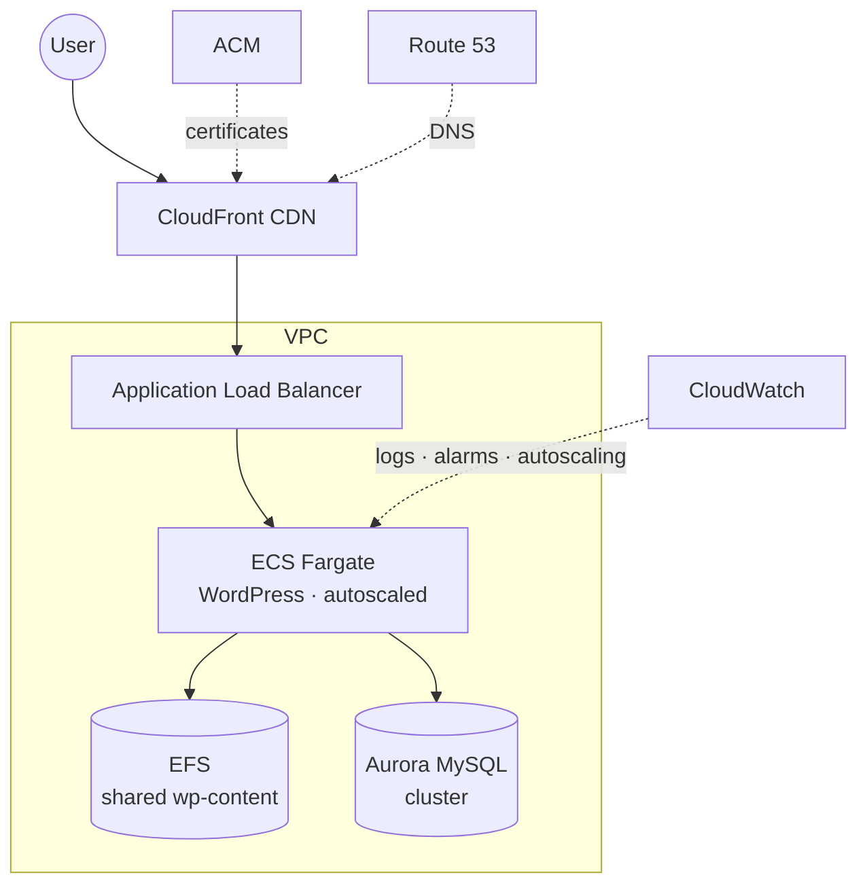

# WordPress on AWS — Infrastructure as Code

[](https://github.com/joegarb/wordpress-terraform/actions/workflows/ci.yml)
[](LICENSE)

Modular Terraform for running a WordPress site on AWS, with separate **production** and **staging** environments that deliberately use different infrastructure tiers.

> ⚠️ **Status — reference architecture (2023), pending modernization.**
> Built and last run in 2023, and pinned to older Terraform provider/module versions. It's kept as a reference, not actively maintained or deployed. CI validates and security-scans it (report-only — the current finding backlog is visible under the repo's **Security → Code scanning** tab). A modernization pass (provider/module upgrades + security hardening) is still to do.

## Two tiers, on purpose

Production and staging run on **intentionally different** setups — a cost-saving tradeoff, with the known downside that staging isn't a faithful copy of production.

- **Production — [`wordpress-enterprise`](modules/wordpress-enterprise)**: a highly-available, containerized stack (diagram below).
- **Staging — [`wordpress-all-in-one`](modules/wordpress-all-in-one)**: a single EC2 instance running WordPress via docker-compose, with scheduled stop/start to save money while idle.

## Production architecture



## Repository layout

| Path | What |
|---|---|
| `environments/production` | Production root module (uses `wordpress-enterprise`) |
| `environments/staging/staging1` | Staging root module (uses `wordpress-all-in-one`) |
| `modules/wordpress-enterprise` | Fargate + ALB + CloudFront + Aurora + EFS + VPC |
| `modules/wordpress-all-in-one` | Single-EC2 WordPress via docker-compose |

Each environment and module has its own README with setup steps and variables.

## Working with it

- **Prerequisites:** Terraform, and — to deploy — an AWS account.
- **Validate for free:** static checks need no AWS credentials and cost nothing —

  ```bash
  terraform -chdir=environments/production init -backend=false
  terraform -chdir=environments/production validate
  ```

  This is what CI runs, alongside `tflint` and a [Trivy](https://trivy.dev) security scan.
- **Deploy:** see the per-environment READMEs. `terraform apply` provisions real, billable AWS resources (Fargate, Aurora, ALB, CloudFront, NAT gateways) — not free.
