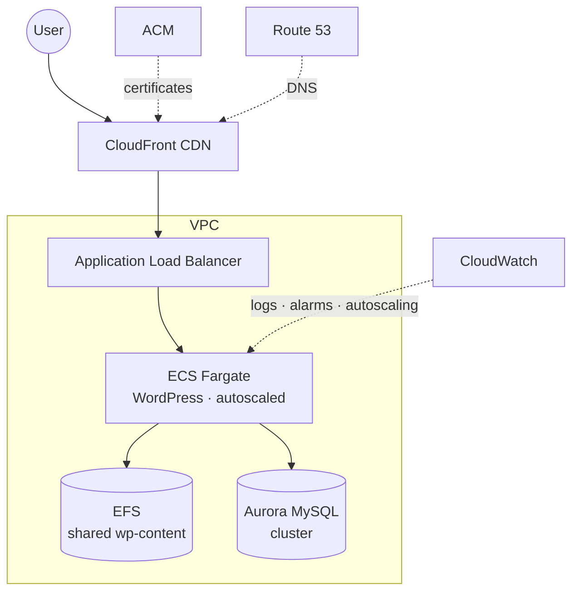

# WordPress on AWS

Modular Terraform for running a WordPress site on AWS, with separate production and staging environments on different infrastructure tiers.

> **Status:** reference architecture from 2023, pinned to older Terraform provider/module versions. Kept as a reference, not actively maintained or deployed. CI still validates and security-scans it (report-only; the finding backlog is under the repo's Security → Code scanning tab). Provider/module upgrades and security hardening are still to do.

## Environments

Production and staging use different infrastructure tiers to save cost. The tradeoff is that staging isn't a faithful copy of production.

- **Production — [`wordpress-enterprise`](modules/wordpress-enterprise)**: a highly-available, containerized stack (diagram below).
- **Staging — [`wordpress-all-in-one`](modules/wordpress-all-in-one)**: a single EC2 instance running WordPress via docker-compose, with scheduled stop/start to save money while idle.

## Production architecture



## Repository layout

| Path | What |
|---|---|
| `environments/production` | Production root module (uses `wordpress-enterprise`) |
| `environments/staging/staging1` | Staging root module (uses `wordpress-all-in-one`) |
| `modules/wordpress-enterprise` | Fargate + ALB + CloudFront + Aurora + EFS + VPC |
| `modules/wordpress-all-in-one` | Single-EC2 WordPress via docker-compose |

Each environment and module has its own README with setup steps and variables.

## Usage

- **Prerequisites:** Terraform, plus an AWS account to deploy.
- **Validate:** static checks run without AWS credentials:

  ```bash
  terraform -chdir=environments/production init -backend=false
  terraform -chdir=environments/production validate
  ```

  This is what CI runs, alongside `tflint` and a [Trivy](https://trivy.dev) security scan.
- **Deploy:** see the per-environment READMEs. `terraform apply` provisions billable AWS resources (Fargate, Aurora, ALB, CloudFront, NAT gateways).
